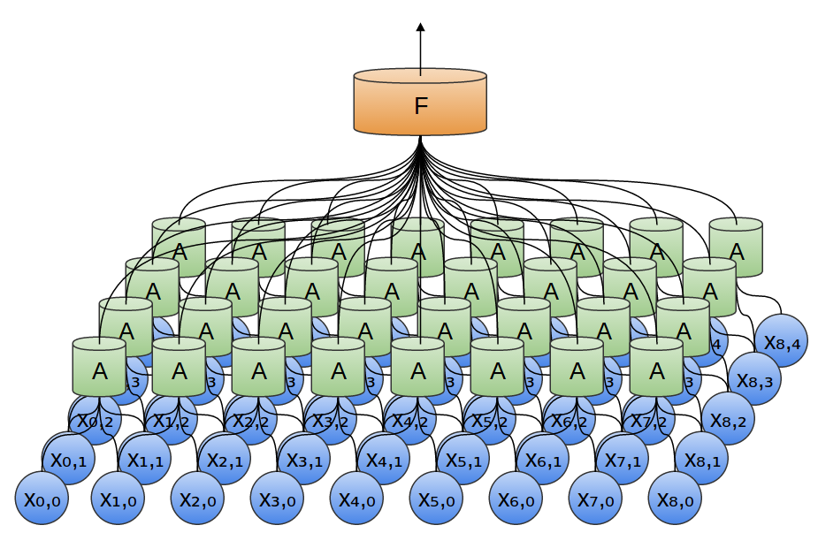

# Analysis of convolutional neural nets

At its most basic, convolutional neural networks can be thought of as a kind of neural network that uses many identical copies of the same neuron.

- x : input layer 
- A : Convolutional Layer
- F : Fully Connnected layer

Fully-connected layer: 
Neurons in a fully connected layer have full connections to all activations in the previous layer, as seen in regular Neural Networks. Their activations can hence be computed with a matrix multiplication followed by a bias offset. 

 
Pooling Layer: 
Convolutional layers are often interweaved with pooling layers. In particular, there is a kind of layer called a max-pooling layer that is extremely popular. A max-pooling layer takes the maximum of features over small blocks of a previous layer. The output of the max pooling layer tells us if a feature was present in a region of the previous layer, but not precisely where.
 

The above image is an example of 1D convolution.
Here's an example of a 2D convolutional network: 

Again, 
- x : input layer 
- A : Convolutional Layer
- F : Fully Connnected layer

We can also do max pooling in two dimensions. Here, we take the maximum of features over a small patch. What this really boils down to is that, when considering an entire image, we don’t care about the exact position of an edge, down to a pixel. It’s enough to know where it is to within a few pixels. 

 

In traditional convolutional layers, A is a bunch of neurons in parallel, that all get the same inputs and compute different features.

 

Many important image transformations are convolutions where you convolve the image function with a very small, local function called a “kernel.”

The kernel slides to every position of the image and computes a new pixel as a weighted sum of the pixels it floats over.

 
**Overview and intuition without brain stuff**:
Lets first discuss what the CONV layer computes without brain/neuron analogies. 
- The CONV layer’s parameters consist of a set of learnable filters. 
- Every filter is small spatially (along width and height), but extends through the full depth of the input volume. For example, a typical filter on a first layer of a ConvNet might have size 5x5x3 (i.e. 5 pixels width and height, and 3 because images have depth 3, the color channels). 
- During the forward pass, we slide (more precisely, convolve) each filter across the width and height of the input volume and compute dot products between the entries of the filter and the input at any position.
- As we slide the filter over the width and height of the input volume we will produce a 2-dimensional activation map that gives the responses of that filter at every spatial position.  
- Intuitively, the network will learn filters that activate when they see some type of visual feature such as an edge of some orientation or a blotch of some color on the first layer, or eventually entire honeycomb or wheel-like patterns on higher layers of the network. 
- We will have an entire set of filters in each CONV layer (e.g. 12 filters), and each of them will produce a separate 2-dimensional activation map. We will stack these activation maps along the depth dimension and produce the output volume.